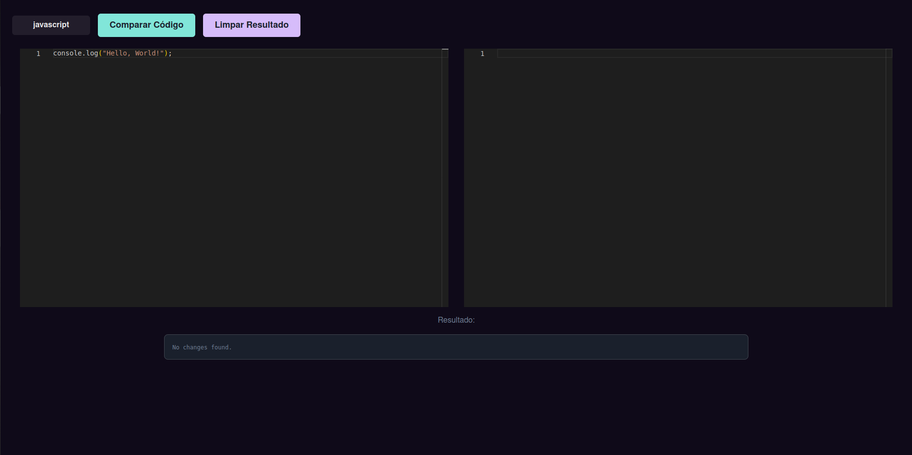

# diff

**Conteúdo da Disciplina**: Programação Dinâmica 

## Alunos
| Matrícula  | Aluno                        |
| ---------- | ---------------------------- |
| 21/1039250 | Arthur Grandão de Mello      |
| 21/1029540 | Pedro Sena Barbosa Holtz Yen |

## Sobre 
Nosso projeto busca mostrar as alterações entre dois códigos, similar à interface de diff de commits do GitHub.

## Screenshots
* ### Tela inicial
</img>

* ### Inserção dos códigos
</img>

* ### Resultado da comparação
</img>

## Uso 
1. Acesse o [gh-pages do projeto](https://projeto-de-algoritmos-2024.github.io/PD_diff/);
2. Clique no botão com a linguagem de programação para selecionar a linguagem desejada;
3. Digite o código 'original' no editor da esquerda e o código 'novo' no editor da direita;
4. Clique em "Comparar Códigos" para obter o resultado;

## [Apresentação](https://youtu.be/YzISMdr7R4M)

